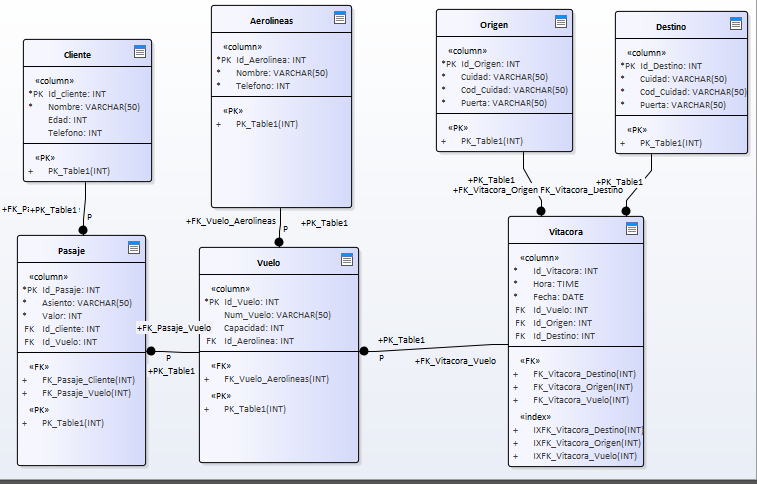

# Documents
taller Semana 1 , Para LandSoft

## Comenzando 🚀
_1.Definir modelo relacional de base de datos que soporte la información de un vuelo con su lista de pasajeros._

_2.Generar el script SQL del modelo anterior. (https://github.com/daniels0009/Documents/blob/main/script%20SQL%20del%20modelo%20de%20vuelo..sql)_

_3.subir un archivo y hacer en él todo lo visto en los videos, se validará el histórico de cambios.()_
